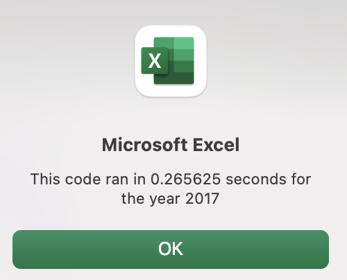
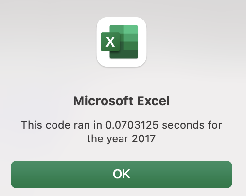
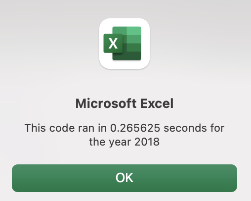
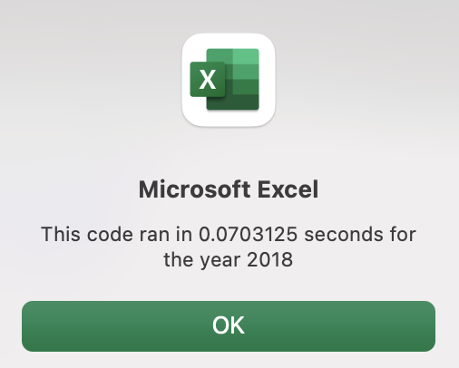

# Stock Analysis

## Overview of Project 
Steve recently graduated with a degree in finance. His parents are showing their support of his academics and education by becoming his first clients. they have a special interest in green enery. While Steve's parents wanted to invest all of their money into one company, Steve wanted to research a few more green energy stocks. In order to look at all of the stocks Steve has chosen, we used VBA to perform functions that give us a better understanding of each company. Steve can easily analyze the dataset with the use of the code in VBA. The code we originally built processed the 12 stocks Steve chose to further research; however, we realized that it would not be ideal if we wanted to analyze much larger sets of stock data. In order to make this code more friendly to large data sets, we refactored the code. 
## Results 
There are a few key results after refactoring the original code. The time to run the code to perform an analysis of both the 2017 and 2018 stocks was reduced. 
### 2017 Run Times 

As you can see in the image above, it took .265625 seconds to run the original code for the year 2017. 

In the refactored code, the code ran in .0703125 seconds. 
### 2018 Run Times 

The original 2018 code ran in .265625 seconds, which is the same as the 2017 code. 

The refactored run time for 2018 stayed the say as the 2017 refactored run time of .0703125 seconds. 
### Analysis of thhe 2017 and 2018 Run Times 
While the original and refactored run times are both quick, it is important to note that we are looking at a dataset of 12 stocks. If we were to have 100 stocks, this tiem difference would help our work and analyzation move forward at the most efficient pace. Trading and buying stocks can be realtively fast-paced in the real-world. We would want the quickest run time possible. 

compare the performance between 2018 and 2018, as well as the execution times of the original script and the refactored script.
## Summary 
### Advantages and Disadvantages to Refactoring Code in General 
  * There are a few advantages of refactoring code. 
### How These Advantages and Disadvantages Related to This Dataset 
